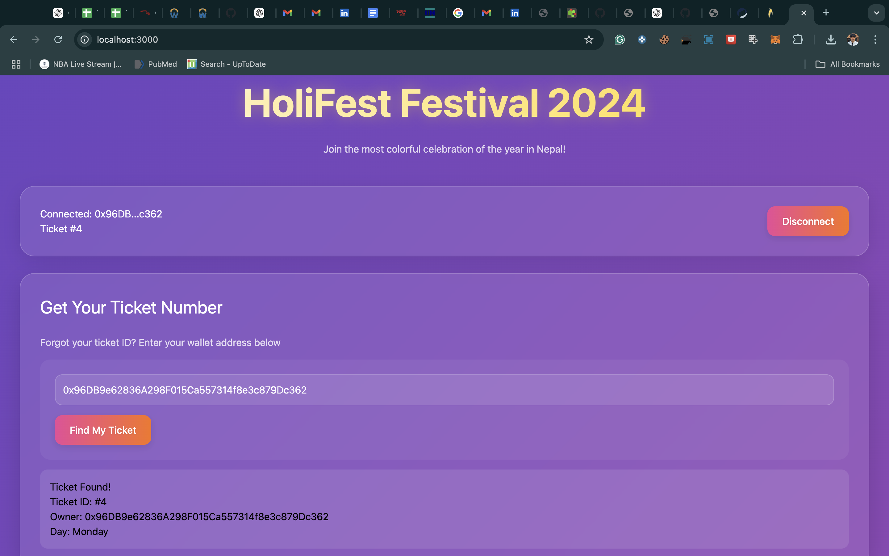
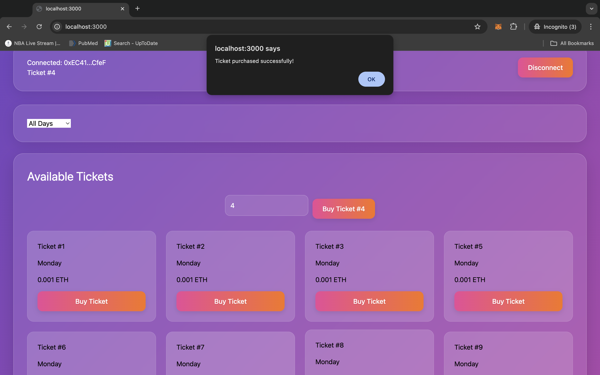
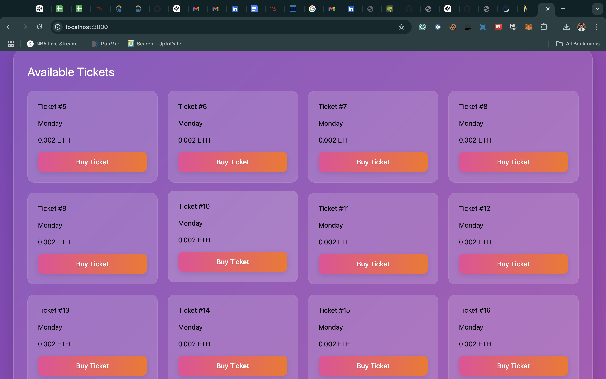
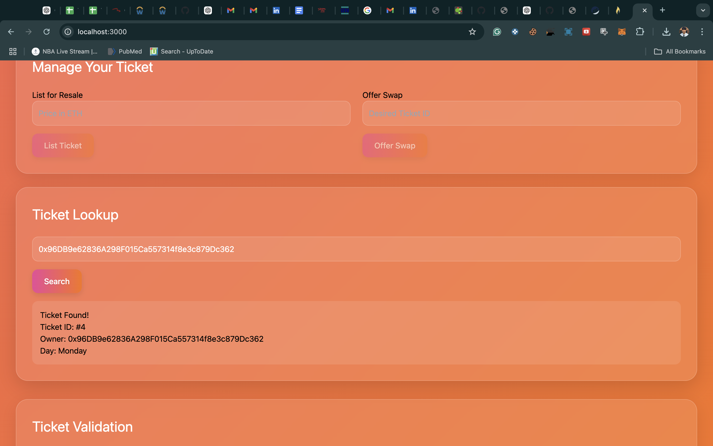
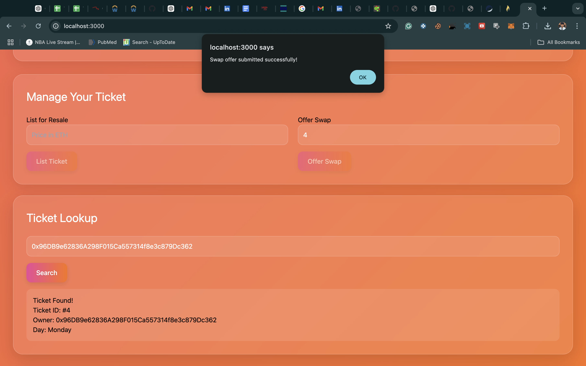
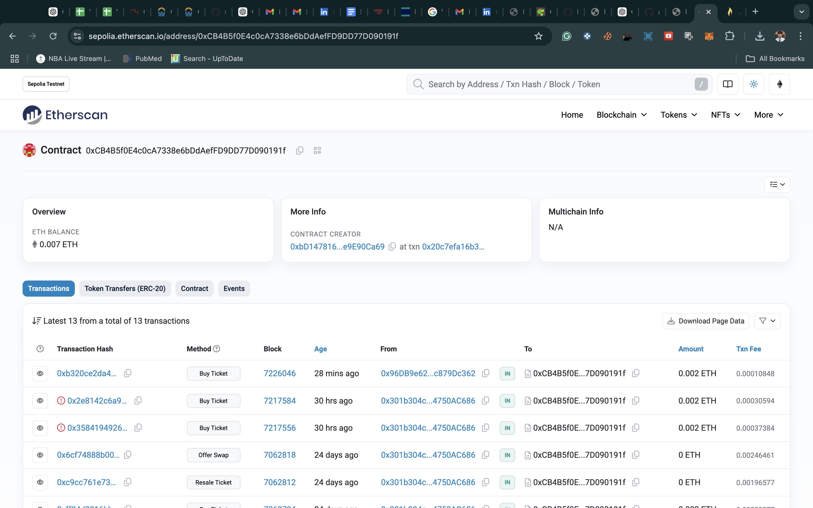
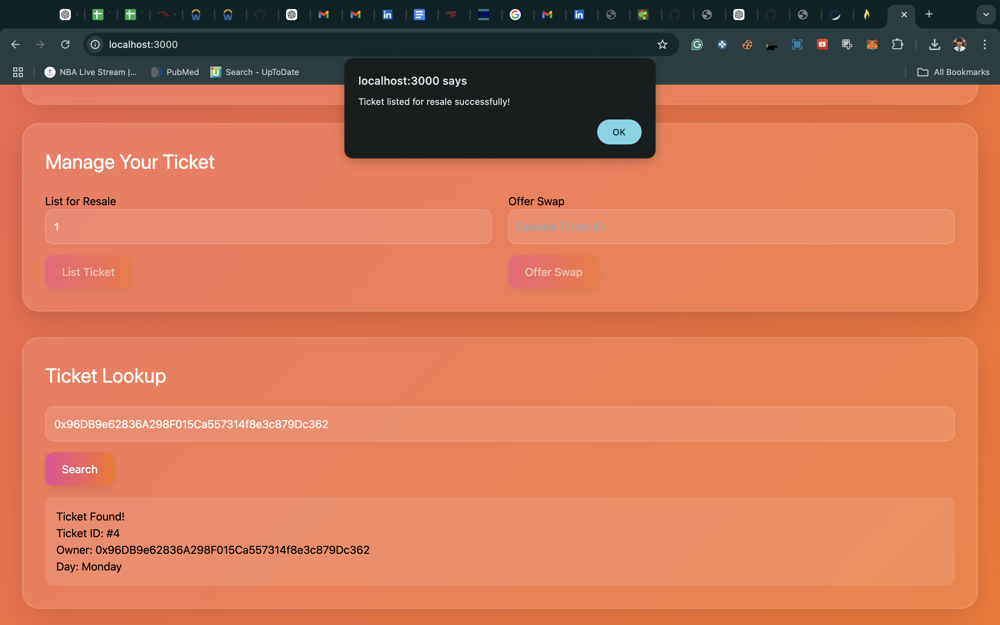

# 🎟️✨ **Tihar Ticket Sale - Decentralized Ticketing Platform**  

---

## ⚠️ **Important Note**  

🚨 **Having trouble?** If you face any issues compiling the project, download and watch the **Loom video walkthrough** for step-by-step guidance!  

---

## 🌟 **Platform Preview**  










🎥 **Loom Video**  
[📺 Watch the Walkthrough](loom-video.mp4)  

🌐 **LIVE DEMO**  
### [https://holi-fest-pass.vercel.app/](https://holi-fest-pass.vercel.app/)
---

## 🛠️ **Tech Stack**  

### **🔗 Blockchain**  
- **Solidity**: ^0.8.17  
- **Hardhat**: Development Environment  
- **Ethers.js**: v5.7.2 (Blockchain Interaction)  
- **Web3Modal**: Wallet Connection  
- **Sepolia Testnet**: Blockchain Network  

### **💻 Frontend**  
- **Next.js**: 15.0.2  
- **React**: 18.3.1  
- **CSS Modules**: Styling  
- **Web3.js**: Blockchain Interaction  

---

## 📌 **Quick Links**  

🔗 [**Live Platform**](https://tihar-ticket-sale.vercel.app/)  
📝 [**Smart Contract**](https://sepolia.etherscan.io/address/YOUR_CONTRACT_ADDRESS)  
🎫 [**Buy Tickets**](https://tihar-ticket-sale.vercel.app/buy)  
📚 [**Documentation**](https://tihar-ticket-sale.vercel.app/docs)  

---

## 🚀 **About The Project**  

🎉 **Tihar Ticket Sale** modernizes event ticketing for Nepal’s Tihar festival. Powered by Ethereum blockchain, the platform offers secure, transparent, and innovative features.  

---

### ✨ **Key Features**  

| 🌟 **Feature**       | 🔍 **Description**                         |  
|----------------------|---------------------------------------------|  
| 🎟️ **Secure Ticketing**  | Buy tickets using cryptocurrency            |  
| 🔄 **Resale Market**      | Sell and buy verified resale tickets        |  
| 🤝 **Ticket Swapping**    | Exchange tickets with other users           |  
| 📅 **Day-wise Access**    | Separate tickets for each festival day      |  
| 👨‍💼 **Manager Dashboard** | Manage tickets, pricing, and analytics      |  
| ✅ **Validation System**   | Instant blockchain ticket validation        |  

---

## 📋 **Prerequisites**  

💡 Before you begin, make sure you have the following:  
- 🖥️ **Node.js**: v14 or higher  
- 🔐 **MetaMask Wallet**  
- 🌐 **Sepolia Testnet ETH**  
- 🔗 **Infura Account**  

---

## 🛠️ **Installation & Setup**  

### Step 1️⃣: **Clone the repository**  
```bash  
git clone https://github.com/abhiishek340/Tihar-Ticket-Sale.git  
cd Tihar-Ticket-Sale  
```  

### Step 2️⃣: **Install dependencies**  
```bash  
npm install  
```  

### Step 3️⃣: **Environment setup**  
Create a `.env` file in the root directory:  
```env  
INFURA_URL=https://sepolia.infura.io/v3/YOUR_INFURA_PROJECT_ID  
PRIVATE_KEY=YOUR_WALLET_PRIVATE_KEY  
MANAGER_ADDRESS=YOUR_MANAGER_WALLET_ADDRESS  
```  

### Step 4️⃣: **Compile the contract**  
```bash  
npx hardhat clean  
npx hardhat compile  
```  

### Step 5️⃣: **Deploy to Sepolia**  
```bash  
npx hardhat run scripts/deploy.js --network sepolia  
```  

---

## 🧪 **Testing**  

✅ Run tests to ensure everything works as expected:  
```bash  
npx hardhat test  
```  

### 🔍 **Test Cases Include**  
- Contract deployment verification  
- Ticket purchase and ownership functionality  
- Ticket swapping mechanism  
- Resale and pricing checks  
- Proper service fee handling  

---

## 🎨 **UI Features**  

🌟 **Festival-Inspired Design:** Responsive light/dark mode with festive animations  
💳 **Wallet Integration:** Secure MetaMask login and network validation  
🎟️ **Ticket Management:** Buy, swap, and resell tickets seamlessly  
📊 **Manager Dashboard:** Manage tickets, view stats, and update prices  

---

## 🔐 **Security**  

🔒 **Best Practices Followed**  
- Sensitive keys stored in `.env` files  
- Role-based contract functions (e.g., Manager-only features)  
- Blockchain ensures single ownership of tickets  

---

## 🌐 **Network Setup**  

💡 Add **Sepolia Testnet** to MetaMask for testing:  

- **Network Name:** Sepolia Test Network  
- **RPC URL:** [https://sepolia.infura.io/v3/](https://sepolia.infura.io/v3/)  
- **Chain ID:** 11155111  
- **Currency Symbol:** SepoliaETH  
- **Explorer:** [https://sepolia.etherscan.io/](https://sepolia.etherscan.io/)  

---

## 📞 **Contact & Support**  

| 📬 Contact Method | Details                                 |  
|--------------------|-----------------------------------------|  
| 👤 **Developer**    | Abhishek Yadav                        |  
| 🌐 **GitHub**       | [@abhiishek340](https://github.com/abhiishek340) |  
| 📧 **Email**        | abhiishek340@gmail.com                |  

---

## 🙏 **Acknowledgments**  

✨ **Special Thanks:**  
- **Tihar Festival Community**  
- **Ethereum Blockchain Technology**  
- **Powered by Vercel Deployment**  

---  

